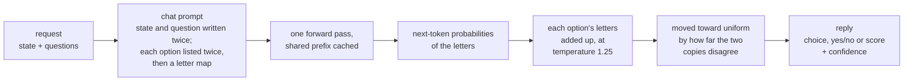
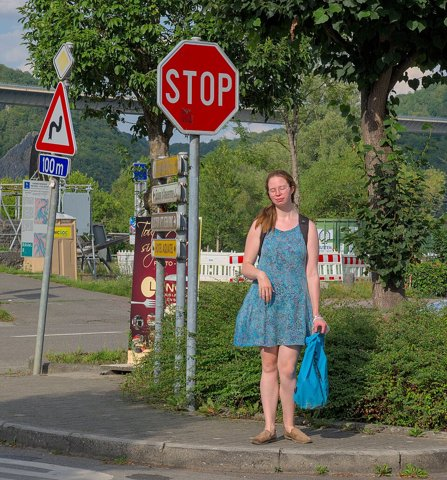
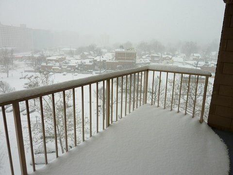
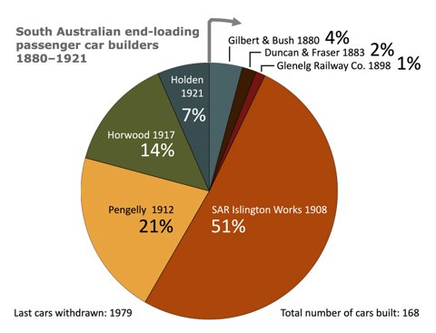

# Lichen

Lichen is a drop-in, API-compatible replacement for Jev, TypeSafe's System One
model, that runs open-weight models on local hardware. It serves the same
`/v1/systemone` endpoint and returns the same typed answers (choice, noul and
score) with a probability for every option, so existing Jev clients work
against it without changes.

On the 231 public decisions of [JevBench](https://github.com/fstandhartinger/jevbench),
Lichen with Google's gemma-4-26B-A4B and its default options answers 207
correctly, against 200 for Jev 1.13. The two disagree on 13 items, 10 of them in
Lichen's favour: likely a real edge, though not statistically significant on this
many items (p = 0.09). The model alone, without Lichen's prompt techniques,
answers 202. The techniques probably add a few points on the hard tier, and
they reach that accuracy with half the input tokens of asking once per rotation
of the options. A decision takes 93 ms at the median on one laptop GPU with
llama.cpp. Served from vLLM instead, the same model takes 56 ms with no
significant change in accuracy. On that one GPU it can also hold a 128k-token
chat with thinking, and judge images (see [Serving from vLLM](#serving-from-vllm)).

## How it works

Lichen never generates text. Each question becomes one chat prompt that lists
the possible answers as labels (letters for a choice, Yes and No for a yes/no
question, digits for a score), and the answer is the probability the model
gives each label as its next token. One forward pass yields the model's own
distribution over the answers, with nothing to parse. The idea comes from
Duarte O. Carmo's post [Jev in 25 lines of Python](https://www.nobodywho.ai/posts/jev-in-25-lines/)
for NobodyWho. Lichen adds the prompt changes and the confidence correction
described below, and a server that speaks the TypeSafe API.



Two changes to the prompt aim at more accurate answers, and two changes to how
the answer is read make its confidence honest. On gemma-4-26B-A4B the prompt
changes add a few hard items; on smaller models they add more.

A causal model reads the prompt left to right, so it takes in the state before
it knows what will be asked about it. Lichen writes the state and the question
twice; the second copy is read with the question already in view. This is
prompt repetition, from Leviathan et al., "Prompt Repetition Improves
Non-Reasoning LLMs" (arXiv 2512.14982).

Small models also favour an answer for its place in the list. Lichen lists
every option twice, the second time in a rotated order, and then maps letters
to options (A -> billing, ..., F -> billing). Each option's answer is the sum
over its letters. This one prompt matches the accuracy of asking once per
rotation of the options and averaging, with half the input tokens.

The two copies of the list are two readings of the same question. On
JevBench's 139 public choices, the readings of a wrong answer disagreed about
six times as much as those of a right one. Lichen moves each answer toward
uniform in proportion to that disagreement, which lowers the confidence of
answers the model is unsure of and never changes which answer comes first.
This rule was picked over one alternative by their calibration on JevBench's
public items.

Raw label probabilities are also too sharp: the model states 99% where it is
right far less often. Lichen divides the label logits by a temperature of 1.25
before the softmax. That value was fitted on the project's own 98 test
questions in `bench/`, not on JevBench, and like the correction above it
changes no answer.

A line in the system prompt also tells the model that the state is data, and
that it must not follow instructions written inside it.

## Results

Public items of JevBench v1.4, scored by JevBench's own harness:

| System | Easy | Standard | Hard | Accuracy | Median latency |
|---|---|---|---|---|---|
| Lichen, gemma-4-26B-A4B QAT | 48/48 | 71/72 | 88/111 | 0.896 | 93 ms |
| Lichen, gemma-4-26B-A4B NVFP4 on vLLM† | 48/48 | 71/72 | 85/111 | 0.883 | 56 ms |
| gemma-4-26B-A4B QAT alone (no prompt techniques) | 48/48 | 71/72 | 83/111 | 0.874 | 85 ms |
| Lichen, Qwen3.6-35B-A3B\* | 48/48 | 71/72 | 83/111 | 0.874 | 468 ms |
| Lichen, Qwen3.5-9B\* | 48/48 | 71/72 | 82/111 | 0.870 | 195 ms |
| Jev 1.13.0 (TypeSafe, hosted) | 48/48 | 71/72 | 81/111 | 0.866 | 665 ms |
| Lichen, gemma-4-E4B QAT | 48/48 | 69/72 | 64/111 | 0.784 | 59 ms |

\* Measured with the earlier configuration, which asked each choice once per
rotation of its options instead of listing them twice.

† unsloth's NVFP4 build on vLLM 0.30, served as in [Serving from vLLM](#serving-from-vllm),
which adds `--question-first --compact-json`. Paired with the QAT row, 9 items
are right only there and 6 only here (p = 0.61), and four vLLM configurations
scored 204 to 206 of 231. It runs at temperature 2.25, fitted for it the same
way as the QAT model's 1.25; at 1.25 its hard-tier calibration error was 0.177,
and at 2.25 it is 0.119, with the same answer on every item.

The model alone was run through the same server with the guard line and none
of the other options. Lichen's latencies are local, one request at a time on an
otherwise idle GPU; Jev's are its hosted API, including the network round trip,
so the column compares deployments rather than models. Items decided by a small
margin can come out differently on another GPU, so a difference of a few hard
items between two rows is within that variation.

On the hard tier, gemma-4-26B-A4B also has a calibration error (ECE) of 0.120
and a JevBench calibration score of 77.5; Jev's on the published board is 76.3.
JevBench's official score also uses held-out items and weighs calibration,
speed and cost, so this table is the public part only. [docs/RESULTS.md](docs/RESULTS.md)
has the published systems for comparison, the other models tried, a Doom
benchmark, the speed measurements and the method in detail; the runs are in
`results/jevbench/`.

## Run it

This needs Docker with the NVIDIA container toolkit. The results above came from
an RTX 5090 Laptop GPU (24 GB).

Download the default model, Google's QAT build of gemma-4-26B-A4B (Apache 2.0,
about 14 GB). It is a mixture-of-experts model, with about 4B parameters active
per token:

```
hf download google/gemma-4-26B-A4B-it-qat-q4_0-gguf gemma-4-26B_q4_0-it.gguf --local-dir models
```

Build the image. The default targets every architecture from Ampere through
Blackwell; setting `CUDA_ARCHITECTURES` to the target GPU alone builds much
faster (`120` for RTX 50-series, `89` for RTX 40-series, `86` for RTX 30-series):

```
docker build -t lichen --build-arg CUDA_ARCHITECTURES=120 .
```

If `apt-get` fails with a 404 during the build, the Ubuntu mirror's index is
ahead of its packages; building again later usually works. A build that must
succeed now can list only `archive.ubuntu.com` (suites `noble noble-updates
noble-backports`) in `/etc/apt/sources.list.d/ubuntu.sources` before
`apt-get update`, since Ubuntu also publishes security fixes to `-updates`.

Start the server. The image turns on the configuration described above, with
a 16k context:

```
docker run --rm --gpus all -p 8765:8765 -v "$PWD/models:/models:ro" \
    lichen --model /models/gemma-4-26B_q4_0-it.gguf
```

Send a request:

```
curl -s localhost:8765/v1/systemone -H 'Content-Type: application/json' -d '{
  "state": "Help! My payouts have been failing for 3 days.",
  "model": "lichen",
  "questions": {
    "team": {"type": "choice", "instructions": "Which team should handle this?",
             "criteria": {"billing": "Payments, invoicing, refunds",
                          "technical": "Bugs, outages, integrations",
                          "sales": "Pricing, upgrades, new accounts"}},
    "urgent": {"type": "noul", "instructions": "Does this convey urgency?"}
  }
}'
```

```json
{
  "model": "gemma-4-26B_q4_0-it",
  "answers": {
    "team": {"type": "choice", "choice": "billing",
             "probabilities": {"billing": 0.9509, "technical": 0.0264, "sales": 0.0227},
             "confidence": 0.9264},
    "urgent": {"type": "noul", "noul": 0.9999}
  },
  "usage": {"input_tokens": 356, "output_tokens": 0}
}
```

Existing TypeSafe clients work once their endpoint is set to
`http://localhost:8765`. The server does not check API keys and is meant for a
trusted network. `GET /health` returns the model's name once it has loaded.

## Other models

Any instruction-tuned GGUF that llama.cpp loads can be served. gemma-4-E4B
(`google/gemma-4-E4B-it-qat-q4_0-gguf`, 5.2 GB) is the fast choice at 59 ms,
with `--compact-json --temperature 1.5` added; 1.5 is its temperature fitted on
the same test questions. Qwen3.5-9B scores 0.870 with the earlier
configuration. Qwen3.6-35B-A3B (`unsloth/Qwen3.6-35B-A3B-MTP-GGUF`) crashes
llama.cpp when rotations are batched, so it was measured with the earlier
configuration and without `--batch`:

```
docker run --rm --gpus all -p 8765:8765 -v "$PWD/models:/models:ro" \
    --entrypoint python3 lichen -m lichen.server \
    --model /models/Qwen3.6-35B-A3B-UD-Q4_K_M.gguf --repeat 2 --permute --n-ctx 16384
```

A temperature suits one model and one kind of question, so a model other than
these two needs its own; see `docs/RESULTS.md` for how the fit was done.

## Serving from vLLM

`--vllm-endpoint URL` reads the same method from a vLLM server instead of a
local GGUF. That opens up checkpoints only vLLM serves (FP8, AWQ, NVFP4), and
the one vLLM server can also answer chat requests, with thinking, and read
images. Lichen's side needs no GPU or llama.cpp: `pip install .` is enough,
where a GGUF needs `pip install '.[llamacpp]'`.

On the laptop GPU of the results above (24 GB), this serves Lichen's judgments
with prompts of up to 16k tokens, and chat with up to 128k:

```
VLLM_BATCH_INVARIANT=1 vllm serve unsloth/gemma-4-26B-A4B-it-NVFP4 --served-model-name gemma4 \
    --max-model-len 131072 --gpu-memory-utilization 0.94 --enable-prefix-caching \
    --logprobs-mode processed_logprobs --max-logprobs 64 \
    --scheduling-policy priority --max-num-batched-tokens 4096 --long-prefill-token-threshold 2048 \
    --reasoning-parser gemma4 --default-chat-template-kwargs '{"enable_thinking": true}' \
    --limit-mm-per-prompt '{"image":8,"audio":0,"video":0}'

python -m lichen.server --vllm-endpoint http://localhost:8000 --vllm-model gemma4 \
    --model gemma-4-26b-a4b-nvfp4 --n-ctx 16384 --vllm-priority -1 --max-images 4 \
    --repeat 2 --permute --fibers 2 --fiber-map --shrink --temperature 2.25 \
    --question-first --compact-json
```

| Flags | Why |
|---|---|
| `VLLM_BATCH_INVARIANT=1` | Without it the same request can give probabilities up to 0.09 apart, enough to change a close answer. With it, repeated requests to one running vLLM agree bit for bit, for about 23% more latency. A restart of vLLM does not keep them: see "Other differences". Some models cannot run with it (on vLLM 0.29, Qwen3.8's linear-attention layers); `--max-num-seqs 1` removes most of the variation instead. |
| `--logprobs-mode processed_logprobs`, `--max-logprobs 64` | Lichen restricts each read to the label tokens with `allowed_token_ids`, and needs the log-probabilities after that restriction. Without the mode, most choices fail with an error that names it. `--max-logprobs` must be at least options × fibers. |
| `--max-model-len 131072`, Lichen's `--n-ctx 16384` | Chat gets 128k tokens. Lichen checks each judgment's prompt as vLLM tokenizes it and refuses one over 16k with 422. |
| `--scheduling-policy priority`, Lichen's `--vllm-priority -1` | Judgments go ahead of chat requests waiting in the queue. |
| `--max-num-batched-tokens 4096 --long-prefill-token-threshold 2048` | A long chat prompt is read 2048 tokens at a time, so judgments do not wait for all of it. |
| `--reasoning-parser gemma4`, `--default-chat-template-kwargs` | Chat thinks by default, and the thinking comes back apart from the answer. Lichen's requests turn thinking off. |
| Lichen's `--temperature 2.25` | Fitted for this model with `bench/fit_temperature.py`. The QAT GGUF's 1.25 leaves the NVFP4 model overconfident. |
| `--limit-mm-per-prompt`, Lichen's `--max-images 4` | Up to 4 images a judgment. Each is shown in both copies of the state, so vLLM must allow 8. |

### Speed

On JevBench's 231 public items, one request at a time, against the QAT GGUF on
llama.cpp on the same GPU:

| Prompt tokens | Items | llama.cpp p50 / p95 | vLLM p50 / p95 |
|---|---|---|---|
| under 1,024 | 163 | 81 / 134 ms | 50 / 77 ms |
| 1,024 to 2,047 | 21 | 221 / 286 ms | 102 / 136 ms |
| 2,048 to 4,095 | 10 | 371 / 430 ms | 184 / 210 ms |
| 4,096 and more | 37 | 902 / 1,294 ms | 405 / 583 ms |
| all | 231 | 93 / 928 ms | 56 / 431 ms |

vLLM serves several requests at once, but that adds little here: the GPU is
already busy with one. `bench/load.py` sent the same 231 requests at 1, 4, 8 and
16 at a time and got 8.3, 10.3, 10.9 and 10.9 requests a second, against 4.1
for llama.cpp, which takes one at a time.

A judgment sent while vLLM reads a long chat prompt waits for its share of the
GPU. During the 27.7 s prefill of a 120,000-token chat, 24 judgments took
1.1 s at the median and 2.3 s at most. Without the two prefill flags above they
waited up to 25 s.

### Chat

Clients talk to vLLM directly (`/v1/chat/completions`, OpenAI's format). The
thinking comes back in the message's `reasoning` field (`delta.reasoning` when
streaming), not `reasoning_content`, and the answer in `content`. A request
turns thinking off with `"chat_template_kwargs": {"enable_thinking": false}`.
Thinking spends tokens before the answer, so a small `max_tokens` can end a
reply before its answer starts.

Chat can take images too, sent inline as base64 in an `image_url` content part;
the pie chart under [Images](#images) is one.

With images allowed, vLLM loads the model's vision encoder, 1.08 GiB, and the
KV cache holds 209,497 tokens, which is 1.6 chats of the full 128k at once.
Without images it held 252,174.

### Images

Four of the test pictures, each with what was asked and what came back. The
first three are Lichen judgments at the served settings; the chart went to the
chat endpoint, with thinking on.

| Picture | Request | Answer |
|---|---|---|
|  | State: "A photo from a street survey."<br><br>Which road sign is in the image? (stop, one way, speed limit, no entry)<br><br>Is there a person in the image? | **stop**, 0.978<br><br><br>**yes**, 0.9999 |
|  | State: "A photo from a street survey."<br><br>Which road sign is in the image? (stop, one way, speed limit, no entry) | **no entry**, 0.700; about 0.10 for each of the others. In the benchmark, with the state "The attached image.", this was the least certain of the 125 Commons answers, at 0.41. |
|  | State: "A photo sent in with a weather report."<br><br>Was this picture taken by day or at night?<br><br>Is there snow in the image? | **day**, 0.929<br><br><br>**yes**, 0.9999 |
|  | Chat: "Which builder made the largest share of these cars, and about how many cars is that out of the total? Answer in two sentences." | After 934 tokens of thinking, in 10.0 s: "SAR Islington Works made the largest share of these cars, accounting for 51% of the total. This represents approximately 86 cars out of the 168 built." The chart gives 51% of 168. |

Pictures, resized to 480 pixels: [Trougnouf (Benoit Brummer)](https://commons.wikimedia.org/wiki/File:A_person_in_blue_standing_next_to_a_stop_sign_in_Anseremme,_Belgium_(DSCF7416).jpg), [CC BY 4.0](https://creativecommons.org/licenses/by/4.0);
[Project-128](https://commons.wikimedia.org/wiki/File:Saw_street_sign_(14167641036).jpg), [CC BY 2.0](https://creativecommons.org/licenses/by/2.0);
[Katherine Bowman](https://commons.wikimedia.org/wiki/File:Crystal_City_Snow_-_Daytime_Balcony_View_(4199057962).jpg), [CC BY 2.0](https://creativecommons.org/licenses/by/2.0);
[SCHolar44](https://commons.wikimedia.org/wiki/File:Pie_chart_--_South_Australian_end-loading_passenger_car_builders.png), CC0.

With `--max-images N`, a request may add `images`, a list of up to N images
sent inline, each as a base64 data URL (`data:image/<png|jpeg|webp|gif>;base64,...`),
as a vision model's chat API takes them. Links are refused, so vLLM downloads
nothing. The images belong to the state: each copy of the state shows every
image, after `State:` and before the state's text. With
[this photo](https://commons.wikimedia.org/wiki/File:A_person_in_blue_standing_next_to_a_stop_sign_in_Anseremme,_Belgium_(DSCF7416).jpg)
(Trougnouf, CC BY 4.0), its 960-pixel preview saved as `stop.jpg`:

```
curl -s localhost:8765/v1/systemone -H 'Content-Type: application/json' -d @- <<EOF
{
  "state": "A photo from a street survey.",
  "images": ["data:image/jpeg;base64,$(base64 -w0 stop.jpg)"],
  "questions": {
    "sign": {"type": "choice", "instructions": "Which road sign is in the image?",
             "criteria": {"stop": "Stop", "one_way": "One way", "speed_limit": "Speed limit",
                          "no_entry": "No entry, or do not enter"}},
    "person": {"type": "noul", "instructions": "Is there a person in the image?"}
  }
}
EOF
```

```json
{
  "model": "gemma-4-26b-a4b-nvfp4",
  "answers": {
    "sign": {"type": "choice", "choice": "stop",
             "probabilities": {"stop": 0.9776, "one_way": 0.0076, "speed_limit": 0.0074, "no_entry": 0.0073},
             "confidence": 0.9702},
    "person": {"type": "noul", "noul": 0.9999}
  },
  "usage": {"input_tokens": 1576, "output_tokens": 0}
}
```

An image is 262 prompt tokens on this model, and counts toward `--n-ctx`. More
images than `--max-images` are refused with 422, and a GGUF server does not
start with `--max-images`.

`bench/run_images.py` asks one question about each image in two sets, one
request per image:

| Set | Right | p50 | Per request |
|---|---|---|---|
| 125 photos, paintings, road signs and charts from Wikimedia Commons (`bench/images_commons.jsonl`) | 125/125 | 182 ms | 787 tokens |
| 84 drawn images with exact answers (`bench/images_drawn.py`) | 82/84 | 167 ms | 755 tokens |

The Commons images are CC0, public domain or CC BY. The file lists each one's
page, author and license, and the script downloads them. Each was checked by
eye and the unclear ones left out, so the set shows the method working on real
pictures, not how far it can be pushed. The median confidence was 0.954. The
least sure answers were a no-entry sign with a figure painted on it (0.41,
still the top answer), bar charts with many bars (0.61), and two plain photos of
cars (0.64 and 0.65). The temperature was fitted on text questions, and it
makes these easy pictures look less certain than they are: at 1.25 the median
was 0.998 and the cars were above 0.99. The two drawn misses are dot counts,
four read as five and five as six.

Repeated one at a time on one running vLLM, both sets gave bit-identical answers. Judged 8 at a
time, one answer in each set moved (a dog photo from 0.88 to 0.93, and a
drawn purple shape from 0.51 to 0.70), with the same top answer: batch
invariance is not exact once images are read together, and shrink enlarges the
difference.

### Other differences

- `--model` is the name vLLM serves the model under. `--vllm-model NAME` sends
  that name to vLLM instead, and `--model` is then only the name replies carry.
- `--batch` does nothing here, since vLLM caches the shared prefix itself.
  `--recheck` and `--embedding` are not available, and neither are the models
  whose prompts only the llama.cpp backend builds (Granite Guardian, Qwen3Guard,
  and chat templates that leave a reasoning block open); asking for them is an
  error.
- `usage.input_tokens` counts the whole prompt. With a GGUF it counts only the
  tokens after the cached prefix, so the two are not comparable.
- Each start of vLLM can give different probabilities, even with the same
  launch and `VLLM_BATCH_INVARIANT=1`: over three starts, one JevBench item's
  top answer read 0.85, 0.91 and 0.99. The top answers moved little: vLLM runs
  after separate starts scored 204 to 206 of 231. The cause is not found.

## Options

Arguments after `lichen` in `docker run` are added to the image's defaults, and
a repeated option replaces its default. Run outside the image,
`python -m lichen.server` or `lichen-server` starts with all of these off; pass
`--repeat 2 --permute --batch --fibers 2 --fiber-map --shrink --temperature 1.25 --n-ctx 16384`
for the measured configuration. `docker run --rm --gpus all lichen --help`
lists all of them.

| Option | Effect |
|---|---|
| `--model PATH` | The GGUF file to serve. Required. |
| `--n-ctx N` | Most prompt tokens a judgment may use, refused with 422 above it; on a GGUF also the context llama.cpp allocates. 16384 in the image. |
| `--n-ubatch N` | Tokens per GPU pass, 1024 by default. 2048 makes long prompts 7-9% faster and cost 2 of the 111 hard JevBench items. |
| `--repeat N` | Copies of the state and question in the prompt; 2 in the image. 3 added one hard JevBench item and improved calibration, for 50% more input tokens. |
| `--fibers M`, `--fiber-map` | List each option M times in one prompt, in rotated blocks, and read the answer as the sum over each option's letters; with `--fiber-map`, list the options first and then map letters to them. The image uses 2 and the map. |
| `--permute` | Ask a choice once per rotation of its options and average. With `--fibers`, only a list that would pass 62 letters falls back to this; without `--permute`, such a list is asked once. |
| `--shrink` | Move each answer toward uniform by how far its readings disagree. On in the image. |
| `--temperature T` | Divide the label logits by T before the softmax. The image uses 1.25, fitted for gemma-4-26B-A4B QAT; its NVFP4 build on vLLM uses 2.25. `bench/fit_temperature.py` fits it for another model. |
| `--runoff D` | When a choice's readings disagree by more than D, ask its two leading options alone and split their mass by that answer. Off by default: it added 3 hard JevBench items for gemma-4-E4B and cost 4 for gemma-4-26B-A4B. |
| `--question-first` | Put the question before the state in each copy. The vLLM configuration uses it; on the QAT GGUF it cost 6 hard JevBench items. |
| `--compact-json`, `--rotate-last` | JSON without spaces, and, when rotating, rotating only the last copy's options. `--compact-json` saves little on JevBench. |
| `--trace PATH` | Append each question's separate readings to PATH as JSON lines. |
| `--kv KEY=VALUE` | Override model metadata at load, such as `gemma4.expert_used_count=6`. |
| `--no-guard` | Leave out the system-prompt line about instructions inside the state. |
| `--embedding` | Serve an embedding model, answering by cosine similarity. |
| `--vllm-endpoint URL`, `--vllm-model NAME` | Read the model from a vLLM server instead of a GGUF (see "Serving from vLLM"). |
| `--vllm-priority P` | vLLM scheduling priority of each judgment, lower first; needs vLLM's `--scheduling-policy priority`. |
| `--max-images N` | Most images a request may carry; 0 by default. Needs `--vllm-endpoint`. |
| `--port N`, `--host H` | Where to listen; 8765 on 0.0.0.0 by default. |

## Reproducing the JevBench numbers

With the server running, from a checkout of JevBench:

```
for tier in easy original hard; do
  python3 -m jevbench.cli run --tasks datasets/public/$tier.jsonl --adapter typesafe \
    --endpoint http://localhost:8765 --key-env "" --price-in-per-m 0 --price-out-per-m 0 \
    --results lichen.$tier.jsonl --ledger lichen.ledger.jsonl --raw-dir lichen-raw
done
```

`bench/jevbench_compare.py` puts such runs next to the published systems, using
JevBench's `results/v1.2/jevbench-v1.2-per-task.json`.

## Limits

With a GGUF the server answers one request at a time; with `--vllm-endpoint`,
concurrently. Either way the questions in a request are answered one after another. A choice takes 2 to 62 options, one label each (A-Z, a-z,
0-9), and a score 2 to 10 levels, one digit each. Jev does not publish how it computes a score's
confidence, so Lichen uses the choice formula for both. Every measurement comes
from one GPU model.

## License

MIT; see [LICENSE](LICENSE). The models carry their own licenses; the Gemma 4
models used here are Apache 2.0.
