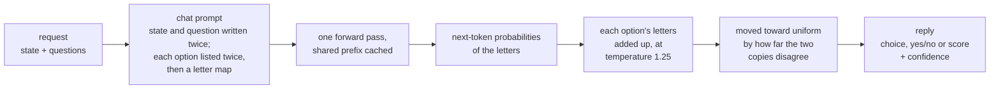

# Lichen

Lichen is a drop-in, API-compatible replacement for Jev, TypeSafe's System One
model, that runs open-weight models on local hardware. It serves the same
`/v1/systemone` endpoint and returns the same typed answers (choice, noul and
score) with a probability for every option, so existing Jev clients work
against it without changes.

On the 231 public decisions of [JevBench](https://github.com/fstandhartinger/jevbench),
Lichen with Google's gemma-4-26B-A4B answers 89.6% correctly, against 86.6% for
Jev 1.13, at a median latency of 93 ms per decision on a single laptop GPU;
Jev's hosted API takes 665 ms.

## How it works

Lichen never generates text. Each question becomes one chat prompt that lists
the possible answers as labels (letters for a choice, Yes and No for a yes/no
question, digits for a score), and the answer is the probability the model
gives each label as its next token. One forward pass yields the model's own
distribution over the answers, with nothing to parse. The idea comes from
Duarte O. Carmo's post [Jev in 25 lines of Python](https://www.nobodywho.ai/posts/jev-in-25-lines/)
for NobodyWho. Lichen adds the prompt changes and the confidence correction
described below, and a server that speaks the TypeSafe API.



Two changes to the prompt make the answers more accurate, and two changes to
how the answer is read make its confidence honest.

A causal model reads the prompt left to right, so it takes in the state before
it knows what will be asked about it. Lichen writes the state and the question
twice; the second copy is read with the question already in view. This is
prompt repetition, from Leviathan et al., "Prompt Repetition Improves
Non-Reasoning LLMs" (arXiv 2512.14982).

Small models also favour an answer for its place in the list. Lichen lists
every option twice, the second time in a rotated order, and then maps letters
to options (A -> billing, ..., F -> billing). Each option's answer is the sum
over its letters. This one prompt matches the accuracy of asking once per
rotation of the options and averaging, with half the input tokens.

The two copies of the list are two readings of the same question. On
JevBench's 139 public choices, the readings of a wrong answer disagreed about
six times as much as those of a right one. Lichen moves each answer toward
uniform in proportion to that disagreement, which lowers the confidence of
answers the model is unsure of and never changes which answer comes first.
This rule was picked over one alternative by their calibration on JevBench's
public items.

Raw label probabilities are also too sharp: the model states 99% where it is
right far less often. Lichen divides the label logits by a temperature of 1.25
before the softmax. That value was fitted on the project's own 98 test
questions in `bench/`, not on JevBench, and like the correction above it
changes no answer.

A line in the system prompt also tells the model that the state is data, and
that it must not follow instructions written inside it.

## Results

Public items of JevBench v1.4, scored by JevBench's own harness:

| System | Easy | Standard | Hard | Accuracy | Median latency |
|---|---|---|---|---|---|
| Lichen, gemma-4-26B-A4B QAT | 48/48 | 71/72 | 88/111 | 0.896 | 93 ms |
| Lichen, Qwen3.6-35B-A3B\* | 48/48 | 71/72 | 83/111 | 0.874 | 468 ms |
| Lichen, Qwen3.5-9B\* | 48/48 | 71/72 | 82/111 | 0.870 | 195 ms |
| Jev 1.13.0 (TypeSafe, hosted) | 48/48 | 71/72 | 81/111 | 0.866 | 665 ms |
| Lichen, gemma-4-E4B QAT | 48/48 | 69/72 | 64/111 | 0.784 | 59 ms |

\* Measured with the earlier configuration, which asked each choice once per
rotation of its options instead of listing them twice.

On the hard tier, gemma-4-26B-A4B also has a calibration error (ECE) of 0.120
and a JevBench calibration score of 77.5; Jev's on the published board is 76.3.
JevBench's official score also uses held-out items and weighs calibration,
speed and cost, so this table is the public part only. [docs/RESULTS.md](docs/RESULTS.md)
has the published systems for comparison, the other models tried, a Doom
benchmark, the speed measurements and the method in detail; the runs are in
`results/jevbench/`.

## Run it

This needs Docker with the NVIDIA container toolkit. The results above came from
an RTX 5090 Laptop GPU (24 GB).

Download the default model, Google's QAT build of gemma-4-26B-A4B (Apache 2.0,
about 14 GB). It is a mixture-of-experts model, with about 4B parameters active
per token:

```
hf download google/gemma-4-26B-A4B-it-qat-q4_0-gguf gemma-4-26B_q4_0-it.gguf --local-dir models
```

Build the image. The default targets every architecture from Ampere through
Blackwell; setting `CUDA_ARCHITECTURES` to the target GPU alone builds much
faster (`120` for RTX 50-series, `89` for RTX 40-series, `86` for RTX 30-series):

```
docker build -t lichen --build-arg CUDA_ARCHITECTURES=120 .
```

Start the server. The image turns on the configuration described above, with
a 16k context:

```
docker run --rm --gpus all -p 8765:8765 -v "$PWD/models:/models:ro" \
    lichen --model /models/gemma-4-26B_q4_0-it.gguf
```

Send a request:

```
curl -s localhost:8765/v1/systemone -H 'Content-Type: application/json' -d '{
  "state": "Help! My payouts have been failing for 3 days.",
  "model": "lichen",
  "questions": {
    "team": {"type": "choice", "instructions": "Which team should handle this?",
             "criteria": {"billing": "Payments, invoicing, refunds",
                          "technical": "Bugs, outages, integrations",
                          "sales": "Pricing, upgrades, new accounts"}},
    "urgent": {"type": "noul", "instructions": "Does this convey urgency?"}
  }
}'
```

```json
{
  "model": "gemma-4-26B_q4_0-it",
  "answers": {
    "team": {"type": "choice", "choice": "billing",
             "probabilities": {"billing": 0.9509, "technical": 0.0264, "sales": 0.0227},
             "confidence": 0.9264},
    "urgent": {"type": "noul", "noul": 0.9999}
  },
  "usage": {"input_tokens": 356, "output_tokens": 0}
}
```

Existing TypeSafe clients work once their endpoint is set to
`http://localhost:8765`. The server does not check API keys and is meant for a
trusted network. `GET /health` returns the model's name once it has loaded.

## Other models

Any instruction-tuned GGUF that llama.cpp loads can be served. gemma-4-E4B
(`google/gemma-4-E4B-it-qat-q4_0-gguf`, 5.2 GB) is the fast choice at 59 ms,
with `--compact-json --temperature 1.5` added; 1.5 is its temperature fitted on
the same test questions. Qwen3.5-9B scores 0.870 with the earlier
configuration. Qwen3.6-35B-A3B (`unsloth/Qwen3.6-35B-A3B-MTP-GGUF`) crashes
llama.cpp when rotations are batched, so it was measured with the earlier
configuration and without `--batch`:

```
docker run --rm --gpus all -p 8765:8765 -v "$PWD/models:/models:ro" \
    --entrypoint python3 lichen -m lichen.server \
    --model /models/Qwen3.6-35B-A3B-UD-Q4_K_M.gguf --repeat 2 --permute --n-ctx 16384
```

A temperature suits one model and one kind of question, so a model other than
these two needs its own; see `docs/RESULTS.md` for how the fit was done.

## Options

Arguments after `lichen` in `docker run` are added to the image's defaults, and
a repeated option replaces its default. Run outside the image,
`python -m lichen.server` or `lichen-server` starts with all of these off; pass
`--repeat 2 --permute --batch --fibers 2 --fiber-map --shrink --temperature 1.25 --n-ctx 16384`
for the measured configuration. `docker run --rm --gpus all lichen --help`
lists all of them.

| Option | Effect |
|---|---|
| `--model PATH` | The GGUF file to serve. Required. |
| `--n-ctx N` | Context in tokens; 16384 in the image. |
| `--n-ubatch N` | Tokens per GPU pass, 1024 by default. 2048 makes long prompts 7-9% faster and cost 2 of the 111 hard JevBench items. |
| `--repeat N` | Copies of the state and question in the prompt; 2 in the image. |
| `--fibers M`, `--fiber-map` | List each option M times in one prompt, in rotated blocks, and read the answer as the sum over each option's letters; with `--fiber-map`, list the options first and then map letters to them. The image uses 2 and the map. |
| `--permute` | Ask a choice once per rotation of its options and average. With `--fibers`, only a list that would pass 62 letters falls back to this; without `--permute`, such a list is asked once. |
| `--shrink` | Move each answer toward uniform by how far its readings disagree. On in the image. |
| `--temperature T` | Divide the label logits by T before the softmax. The image uses 1.25, fitted for gemma-4-26B-A4B. |
| `--runoff D` | When a choice's readings disagree by more than D, ask its two leading options alone and split their mass by that answer. Off by default: it added 3 hard JevBench items for gemma-4-E4B and cost 4 for gemma-4-26B-A4B. |
| `--compact-json`, `--rotate-last` | JSON without spaces, and, when rotating, rotating only the last copy's options. `--compact-json` saves little on JevBench. |
| `--trace PATH` | Append each question's separate readings to PATH as JSON lines. |
| `--kv KEY=VALUE` | Override model metadata at load, such as `gemma4.expert_used_count=6`. |
| `--no-guard` | Leave out the system-prompt line about instructions inside the state. |
| `--embedding` | Serve an embedding model, answering by cosine similarity. |
| `--port N`, `--host H` | Where to listen; 8765 on 0.0.0.0 by default. |

## Reproducing the JevBench numbers

With the server running, from a checkout of JevBench:

```
for tier in easy original hard; do
  python3 -m jevbench.cli run --tasks datasets/public/$tier.jsonl --adapter typesafe \
    --endpoint http://localhost:8765 --key-env "" --price-in-per-m 0 --price-out-per-m 0 \
    --results lichen.$tier.jsonl --ledger lichen.ledger.jsonl --raw-dir lichen-raw
done
```

`bench/jevbench_compare.py` puts such runs next to the published systems, using
JevBench's `results/v1.2/jevbench-v1.2-per-task.json`.

## Limits

The server answers one request at a time, and the questions in a request one
after another. A choice takes 2 to 62 options, one label each (A-Z, a-z,
0-9), and a score 2 to 10 levels, one digit each. Jev does not publish how it computes a score's
confidence, so Lichen uses the choice formula for both. Every measurement comes
from one GPU model.

## License

MIT; see [LICENSE](LICENSE). The models carry their own licenses; the Gemma 4
models used here are Apache 2.0.
